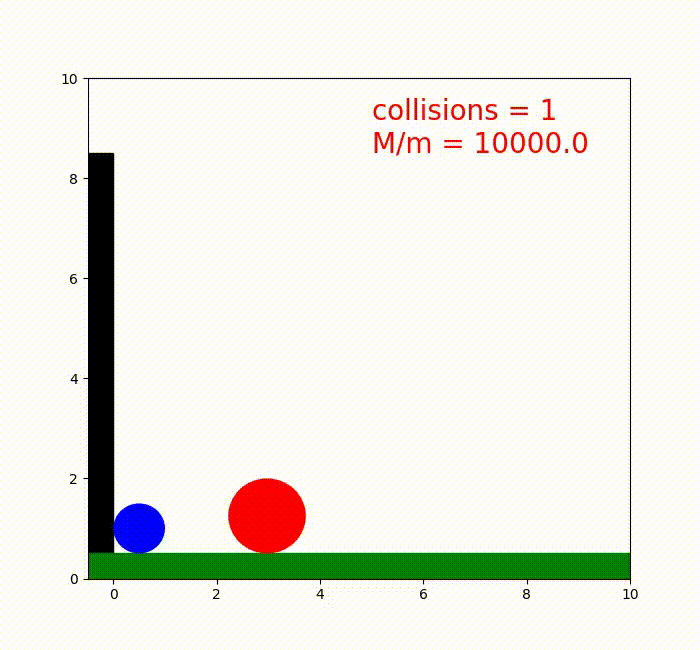

# Collider Pi

The repository was inspirated by the [this](https://www.youtube.com/watch?v=HEfHFsfGXjs) youtube video where they showed that the number of the collision of the system below return with int($\pi \cdot 10^{M/n-1}$).

